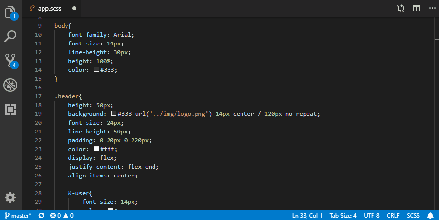

<h1 align="left">
    
    Run on Save - VSCode Extension
</h1>

Configure shell commands and related file patterns, commands will be executed when matched files were saved.


## Features

You can specify status bar messages which will show before and after commands executing, such that they will tell you what's happening and not distrub you much:



If you prefer running commands in vscode terminal, which keeps message colors and give more feedback details, change the `runIn` option to `terminal`.


## Configuration

| Name                             | Description
| ---                              | ---
| `runOnSave.statusMessageTimeout` | Specify the timeout millisecond after which the status bar message will hide, default value is `3000`, means 3 seconds.
| `runOnSave.commands`             | Specify the array of shell commands to execute and related info, its child options as below.


### Command Options

| Name                              | Description
| ---                               | ---
| `commands[].match`                | Specify a RegExp source to match file path. E.g.: `\\.scss$` can used to match scss files.
| `commands[].notMatch`             | Specify a RegExp source, the files whole path match it will be excluded. E.g.: `[\\\\\\/]_[\\w-]+\\.scss$` can be used to exclude scss library files.
| `commands[].command`              | Specify the shell command to execute. You may include variable substitution like what to do in [VSCode Tasks](https://code.visualstudio.com/docs/editor/tasks#_variable-substitution).
| `commands[].runningStatusMessage` | Specify the status bar message when the shell command begin to run, supports variable substitution too. Only works when `runIn=backend`.
| `commands[].finishStatusMessage`  | Specify the status bar message after the shell command finished executing, also supports variable substitution. Only works when `runIn=backend`.
| `commands[].runIn`                |
 - `backend`: Run command silently and show messages in output channel, you can specify runningStatusMessage and finishStatusMessage to give you a little feekback. Choose this when you don't want to be disturbed.
 - `terminal`: Run command in vscode terminal, which keeps message colors. Choose this when you want to get feedback details.
 - `vscode`: Run vscode's command. Choose this if you want to execute vscode's own command or a command of a particular extension.


### Sample Configuration

```json
{
    "runOnSave.statusMessageTimeout": 3000,
    "runOnSave.commands": [
        {
            "match": ".*\\.scss$",
            "notMatch": "[\\\\\\/]_[^\\\\\\/]*\\.scss$",
            "command": "node-sass ${file} ${fileDirname}/${fileBasenameNoExtension}.css",
            "runIn": "backend",
            "runningStatusMessage": "Compiling ${fileBasename}",
            "finishStatusMessage": "${fileBasename} compiled"
        },
        {
            "match": ".*\\.less$",
            "notMatch": "[\\\\\\/]_[^\\\\\\/]*\\.less$",
            "command": "node-sass ${file} ${fileDirname}/${fileBasenameNoExtension}.css",
            "runIn": "terminal"
        },
        {
            "match": ".*\\.py$",
            "command": "python.runLinting",
            "runIn": "vscode"
        }
    ]
}
```


### Variable Substitution

Can be used in `command`, `runningStatusMessage`, `finishStatusMessage`.

For more details please refer to [VSCode Tasks](https://code.visualstudio.com/docs/editor/tasks#_variable-substitution).

| Name                         | Description
| ---                          | ---
| `${workspaceFolder}`         | the path of the folder opened in VS Code.
| `${workspaceFolderBasename}` | the name of the folder opened in VS Code without any slashes (/).
| `${file}`                    | the path of current opened file.
| `${fileBasename}`            | the basename part of current opened file.
| `${fileBasenameNoExtension}` | the basename part without extension of current opened file.
| `${fileDirname}`             | the dirname path part of current opened file.
| `${fileExtname}`             | the extension part of current opened file.
| `${cwd}`                     | the task runner's current working directory on startup.
| `${env.Name}`                | reference environment variables.


## Commands

The following commands are exposed in the command palette

- `Run On Save: Enable` - to enable the extension
- `Run On Save: Disable` - to disable the extension


## References

This plugin inspired from these plugins:

[vscode-runonsave](https://github.com/emeraldwalk/vscode-runonsave) and [vscode-save-and-run](https://github.com/wk-j/vscode-save-and-run).


## License

MIT